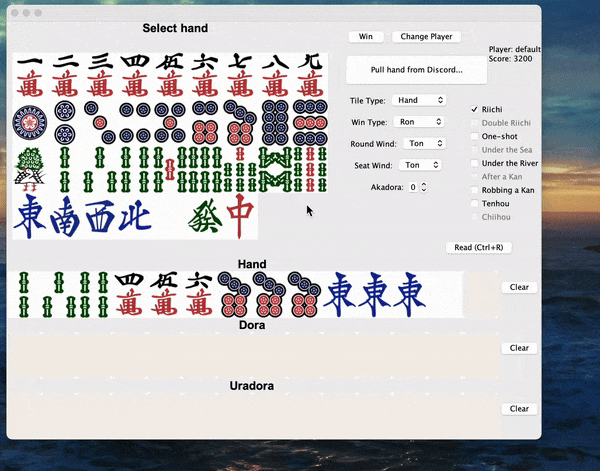
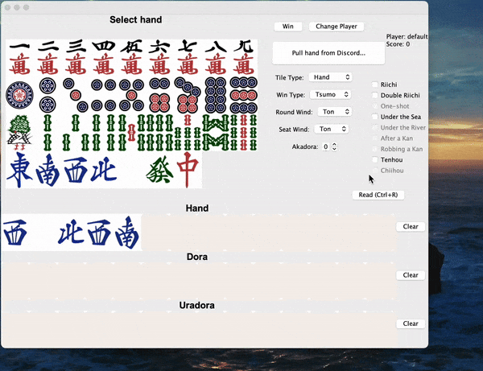

# Riichi Mahjong Calculator
A CSC207 project for calculating the score of a round of Riichi (Japanese) Mahjong.

## Table of Contents
- [1. Authors](#authors-in-alphabetical-order)
- [2. Purpose of this project](#purpose-of-this-project)
- [3. Features](#features)
  - [3.1 Add Tile](#add-tile)
  - [3.2 Update Enabled Tiles](#update-enabled-tiles)
  - [3.3 Remove Tile](#remove-tile)
  - [3.4 Clear Tiles](#clear-tiles)
  - [3.5 Edit Status](#edit-status)
  - [3.6 Calculate Score](#calculate-score)
  - [3.7 Discord Bot](#discord-bot)
  - [3.8 Change Player](#change-player)
  - [3.9 Read Out Loud](#read-out-loud)
- [4. Installation instructions](#installation-instructions)
- [5. Usage Guide](#usage-guide)
- [6. License](#license)
- [7. Giving feedback](#how-to-give-feedback)
- [8. Contributions](#contributions)

## Authors (in alphabetical order)
- Bill Xi (TurkeyBilly)
- Julia Zhong Guo (JuliaGZL)
- Tianchu Li (li-tianchu & Moooebie)
- Yizhou Ai (YAizhou)

## Purpose of this project
This project is a calculator for the score of a round of Riichi (Japanese) Mahjong. It is designed to be used by 
players who want to calculate the score of their Hand after winning a round of Mahjong with others offline, but does not
want to do the calculation by themselves manually or does not have an automatic calculation as there are
in online Riichi Mahjong games. The calculator will take in a username, the tiles in the Hand, and the special 
statuses that the user has experienced during this round. The calculator will output the score and display
the details to the score, as the details are fundamentally important and interesting to the calculation of scores in 
Riichi Mahjong.

Alternatively, this project is also for players who want to calculate the scores and view the details without
opening a specific website or app. The calculator can be used as a Discord bot that can calculate the scores with the
same common functionalities that this calculator has implemented.

This project was made to provide an offline service for calculating the scores of a round of Riichi Mahjong.
While previous solutions were made either in [commercial Riichi Mahjong games](https://mahjongsoul.yo-star.com/) or on [websites](https://linlexiao.com/maj/#/calculator),
this project provides a rare software alternative in English language. 

Lastly, this project can read the Hand and statuses out loud after the user triggers a HotKey, 
which is a feature that is not available in the previous solutions. This feature is designed to help 
users who are visually impaired to use this software.

## Features
This section corresponds to the use cases that we have implemented.

### Add Tile
- **Description**: Add a tile to the Hand.
- This is named as `add_tile` in the use cases.

### Update Enabled Tiles
- **Description**: Update the enabled tiles that the user can add to the Hand.
- This is named as `update_enabled_tiles` in the use cases.

### Remove Tile
- **Description**: Remove a tile from the Hand.
- This is named as `remove_tile` in the use cases.

### Clear Tiles
- **Description**: Clear all tiles from the Hand.
- This is named as `clear_tiles` in the use cases.

### Edit Status
- **Description**: Edit the statuses that the user has experienced during the round to be calculated.
- The statuses in this section include the special characteristics of a special gameplay that is not related to common performances of tiles. Instead, they include how the player has won the game, whether the player has won it specially, the number of Akadora tiles the user has drawn, etc.
- This is named as `edit_status` in the use cases.

### Calculate Score
- **Description**: Calculate the score of the Hand and display the details of the score.
- This is named as `hu_solver` in the use cases.

### Discord Bot
- **Description**: Hold a Discord bot that can accept inputs about the Hand and the statuses on Discord,
calculate the score, and display the score and the details directly on Discord.
- This is named as `discord_bot` in the data accessing section and `pull_remote_hand` in the use cases.

### Change Player
- **Description**: Change the player name to store the Hand and the statuses.
- This is named as `change_player` in the use cases.

### Read Out Loud
- **Description**: Read out the Hand and the statuses or the score and the details out loud.
- This is named as `read_hand` in the use cases.
- To use this feature, either click the "Read (Ctrl+R)" button or press "Ctrl+R" on the keyboard.
To read the score messages, "Ctrl+R" is the only option.

## Installation Instructions
This software is meant to be installed on Linux, macOS, or Windows devices.
1. `git clone` this repository.
2. If you do not have [Java](https://www.java.com/en/download/) on your device, download and install Java.
3. Open the terminal and navigate to the directory where you have cloned this repository.
4. Run `src/main/java/app/Main.java` after compilation with any Java IDE.

Currently, the only package that needs to be installed is `com.discord4j` for the Discord Bot.
This should be installed automatically if maven is configured correctly. If not, you can
view the [Discord4J Guide on Download/Installation](https://docs.discord4j.com/quickstart) for more information.

Note that the version of Java on your device should be no earlier than Java 17.

## Usage Guide
1. Run the program by running `src/main/java/app/Main.java`.
2. The features are displayed on the GUI and are listed in the [Features](#features) section.
The features are self-explanatory, and the sample uses are displayed in the Features section.
3. In general, the user can set a player name, add tiles to the Hand, remove tiles from the Hand,
and select the statuses that the user has experienced during the round.

## License
This project is licensed under the General Public License v3.0. You can view the license [here](LICENSE).

## How to give feedback
You can give feedback by creating an issue on this repository. We will review the issue and respond to it as soon as possible.

Alternatively, you can also share your feedback on the Google Forms [here](https://docs.google.com/forms/d/e/1FAIpQLSflEqnzYVAIO2DjtFSz8hkjzJtEug4QI_Z3QQjjEBrcHxHGxw/viewform?usp=sf_link).

## Contributions
We welcome contributions to this project. You can fork this repository, make changes, and create a pull request. 
We will review the pull request and merge it if it is appropriate.

To fork this project, click the "Fork" button on the top right corner of this repository.

To create a good merge request, please provide a summary of the changes you have made and the reason for the changes.

[//]: # (## Use cases)

[//]: # ()
[//]: # (1. `ChangePlayer`: Amy has finished a round of Japanese Mahjong and wants to calculate the score of her Hand as she won. She inputs a user name and information about the Hand, when the program stores the hand and her user name. Later, she wants to view this Hand and calculate the score again after inputting her user name.)

[//]: # (2. `AddCard`: Bob has won a round of Japanese Mahjong and wants to add cards to the Hand so that he can calculate the scores for the Hand.)

[//]: # (3. `RemoveCard`: Charlie has won a round of Japanese Mahjong and is adding cards to the Hand. However, he has mistakenly added a wrong tile, so he removes this tile.)

[//]: # (4. `EditStatus`: David has taken several special moves in this round of Japanese Mahjong, such as _Chii_ and _Pon_, and suspects that the _Dora indicators_ correspond to some of the tiles in his Hand. He inputs these special statuses for the program to calculate an accurate result.)

[//]: # (5. `ClearCards`: Emily has finished a new round of Japanese Mahjong after calculating the score of her Hand. She wants to clear the Hand so that she can calculate her Hand for this round.)

[//]: # (6. `CalculateScore`: Frank has finished a round of Japanese Mahjong and wants to calculate the score of his Hand. After inputting the user name and information about his Hand and the statuses, the program calculates the score for him.)

[//]: # (7. `DiscordAgent`: George is playing Japanese Mahjong with his friends on Discord. He wants to use a Discord bot to calculate the score of his Hand and show it to his friends.)
